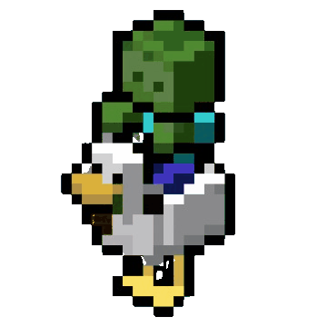

<!-- Profile README: github.com/vichinho -->

<!-- Encabezado centrado -->

  <h1>Bienvenido :)</h1>

<!-- Bloque con texto a la izquierda y GIF a la derecha -->
<table>
  <tr>
    <td valign="middle" style="width:60%;">
      

        En el tejido de la tecnología avanzada, se entreteje una sombra ominosa, donde la línea entre lo humano y lo artificial se desdibuja peligrosamente.
      

    </td>
    <td align="right" valign="middle" style="width:40%;">
      
    </td>
  </tr>
</table>

  
Software Engineering Student • Concepción, CL

  

    <a href="https://github.com/vichinho">GitHub</a> •
    <a href="https://www.linkedin.com/in/vichovct">LinkedIn</a>
  

  <h2>Conocimientos en</h2>
  

